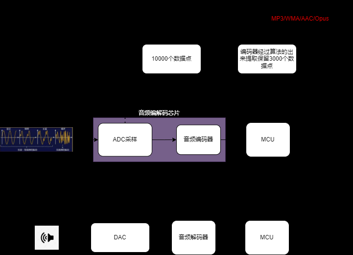

# 音频笔记

## 声音的编解码过程
-   编码过程就是ADC采样到大量的数据，这些数据如果全部保留下来，声音就能百分百的还原。声音的特性有时候并不需要全部的数据，一部分即可。所以就有对应的编码格式来提取数据，这个过程称之为编码过程。反之解码。

### SBC格式
- SBC（Sub-band Coding）是蓝牙音频传输协议A2DP（Advanced Audio Distribution Profile）强制规定的一种蓝牙编码格式。SBC的传输码率通常为328Kbps，44.1KHz/16Bit
### L2HC格式
- L2HC（Low Latency and High Quality Codec）是华为自主研发的高清音频编解码格式，旨在实现高质量的无线音频传输。
- 它支持最高1920kbps的音频传输码率，这一码率远高于CD级无损音乐的传输码率（1.41Mbps），甚至能够传输母带级别（MQA）的音乐内容。
- 因此，L2HC在音质上能够实现接近无损的效果，为用户带来更加清晰、细腻、真实的听感体验

### 芯片2863
- 星闪带有I2S接口+编/解码器

